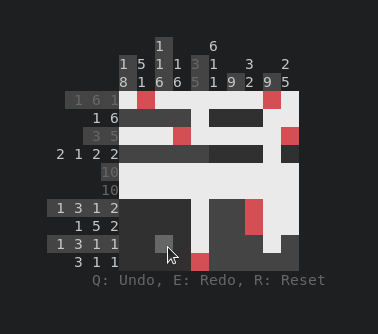

# yayagram - Play nonograms/picross in your terminal

**yayagram** is a puzzle game in which you fill out a grid with cells based on logic and number clues.



*White signifies a filled cell, red signifies a crossed out cell.*

Playing it is as easy as:

```console
cargo install yayagram
yayagram
```

# Features

* Runs in the terminal!
* Cross-platform: runs on Linux, Windows and [probably macOS](#macOS).
* Helpful features like undo, redo and reset that are just a button press away.
* [Create your own grids](#Editor) for others to play.
* A new kind of cell: [maybed](#Maybed).
* A measurement tool to let you enjoy even the biggest of grids.
* Intuitive to play.

# Controls

- Mouse movement: select a cell.
- Left-click: fill a cell.
- Middle-click: [maybe a cell](#Maybed).
- Right-click: cross out a cell.
- `R`: reset the grid.
- `Q` or left arrow key: undo a cell placement or a grid reset.
- `E` or right arrow key: redo a cell placement or a grid reset.
- `M`: Set measurement point.
- `Tab`: toggle the [editor](#Editor).
- `S`: save the edited grid as a file locally.
- `Esc`: exit.

## Editor

Press `Tab` to toggle the editor and start placing the cells for your grid.
You can make use of all cell kinds.
To export your grid, press `S` to save while in editor mode. This will create a new `.yaya` grid file.
Note that in the same session it will always write the grid to the same file again unless renamed.

On Windows you can drag `.yaya` grid files onto the `.exe` to play the grid.

Note that while playing a `.yaya` grid, the file will be empty for the duration of the play before the content will be written back.

## img2yaya

Ran out of `.yaya` files? No ideas for new grids? Don't want to play random grids?

Check out @AaronErhardt's amazing [**img2yaya**](https://github.com/AaronErhardt/img2yaya) to convert images to playable `.yaya` files!

## Command line arguments

The program takes a single number for a squared grid size, two numbers for a width and height or the filename of a `.yaya` grid file.

```shell
yayagram # a random 5x5 grid
yayagram 10 # a random 10x10 grid
yayagram 5 15 # a random 5x15 grid
yayagram example.yaya # a custom grid
```

`--help` and `-h` are also supported.

## Maybed

The blue "maybed" cell kind can be placed on the grid with middle-click and is supposed to make "what if?" reasoning and trying out things easier,
as an alternative to using crossed out or filled cells which might be confusing.
It can help you imagine theoretical situations better.

## Other Tips

- Try to avoid guesssing and play it safe! Guessing can come back later to bite you. Guessing is `unsafe`.
- Don't forget to cross out cells that you are sure won't be filled.
  This helps immensely at ruling out possibilities.

## Example

Here's a simple example to help you grasp the game.

|       | 2 | 3 | 2 |
|-------|---|---|---|
| **2** |   |   |   |
| **3** |   |   |   |
| **2** |   |   |   |

First, let's look at the clues on the very top: the first one is **2**.
It tells us that exactly 2 (2 cells in a row) of the 3 cells below it are filled.
Through logic we can determine that this means that at least the middle cell is definitely filled:

|       | 2 | 3 | 2 |
|-------|---|---|---|
| **2** |   |   |   |
| **3** | ◯ |   |   |
| **2** |   |   |   |

Let's look at what the clue next to it to the right tells us (**3**).
This clue means that there is exactly 3 cells in a row filled below.
Because we only have 3 cells here (because it's a 3x3 grid), we can simply fill out all of those 3 cells safely:

|       | 2 | 3 | 2 |
|-------|---|---|---|
| **2** |   | ◯ |   |
| **3** | ◯ | ◯ |   |
| **2** |   | ◯ |   |

Next clue on the top: **2**. Again through logic we can determine that at least the cell in the middle is definitely filled:

|       | 2 | 3 | 2 |
|-------|---|---|---|
| **2** |   | ◯ |   |
| **3** | ◯ | ◯ | ◯ |
| **2** |   | ◯ |   |

Now let's continue with the clues on the left, starting with the top one: **2**.
Here it's the same, there is definitely at least the middle cell filled,
which is already the case so we can simply move on with the clue below it: **3**.
The row is already filled out so let's move on to the next one: **2**.
Again, nothing to do.
It turns out that we have a pretty rare case here where **two solutions are correct**:

|       | 2 | 3 | 2 |
|-------|---|---|---|
| **2** | ◯ | ◯ |   |
| **3** | ◯ | ◯ | ◯ |
| **2** |   | ◯ | ◯ |

or

|       | 2 | 3 | 2 |
|-------|---|---|---|
| **2** |   | ◯ | ◯ |
| **3** | ◯ | ◯ | ◯ |
| **2** | ◯ | ◯ |   |

Both solutions fulfill the requirements.

I hope this helped you grasp the game a little bit.
Now you can try to apply some of what you learned on a small grid like 3x3 or 5x5 by simply passing the grid size as a command line argument to the program:
`yayagram 3` or `yayagram 5` respectively.

You can also load the above grid into the game by passing this file as a command line argument to the binary: [example.yaya](example.yaya).

## macOS

This game has not been tested on macOS yet. If you can test it, please confirm that:

* If you load a `.yaya` grid file and finished playing it, the data is still present after you either closed the terminal with X or if you quit with `Esc`.
* You are able to load a `.yaya` grid file by dragging it into the executable.

If that's the case or if any of it is not the case, please let me know.
